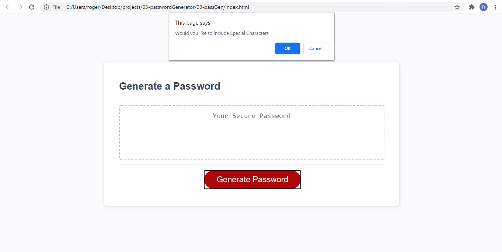

# 03-passGen

## 3rd Assignment UCF Boot Camp

URLs

Deployed Application: 
    https://rogers0404.github.io/03-passGen/

GitHub Repository:
    https://github.com/rogers0404/03-passGen.git
    
    git@github.com:rogers0404/03-passGen.git 

Commits:

Third Assignment in UCF Code Boot Camp

1. It was Created 3 branches to work independently from the master branch
- feature/lenght
- feature/css
- feature/readme

2. Each Branch correspond with a part of the assignment

3. Defining variables with global scope, userChoice as a data structure to store the user choice and listChar as a object to have the inicial seed for al types of characters

4. Alert to present the inicial information to the user and criterias

5. Defining Funtions:
- Function userIntro(), this function validates the entry of the user in order to match the criteria of the lenght of the password.
- Function userSelection(), this function validates he entry of the user in order to match the criteria of the types of characters.
- Development of generatePassword(), this function generate the password from the initial seed variable to another transitional variable call "str" and then to generate the password. 

6. Adding styling to smaller screens. 

7. Commits in GitHub according to each developing step for branch

8. Identation and comments in the script.js file.

Screenshots:

## Inicial Mock-up for the Assignment

## Screenshot 1

## Screenshot 2

## Screenshot 3

## Screenshot 4

## Screenshot 5

## Screenshot 6

## Screenshot 7

## Screenshot 8

## Screenshot 9

## Screenshot 10

## Screenshot 11

## Screenshot 12

